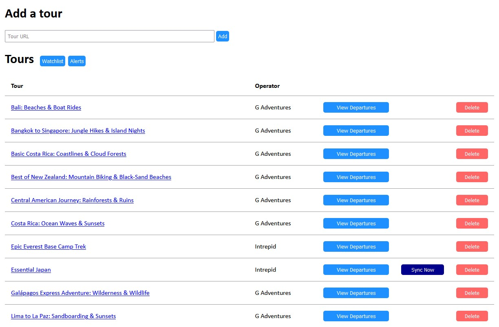
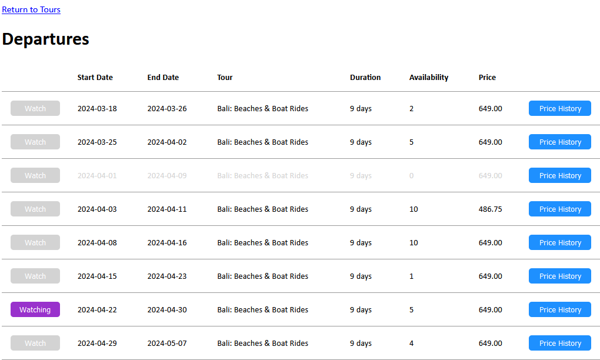
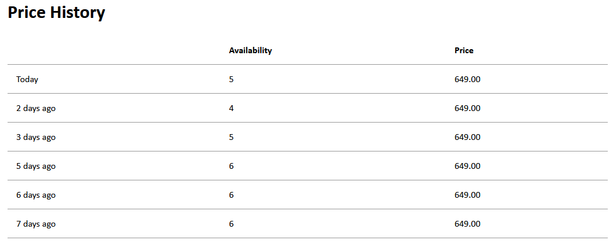
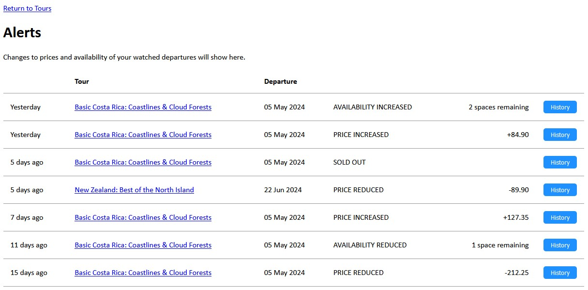
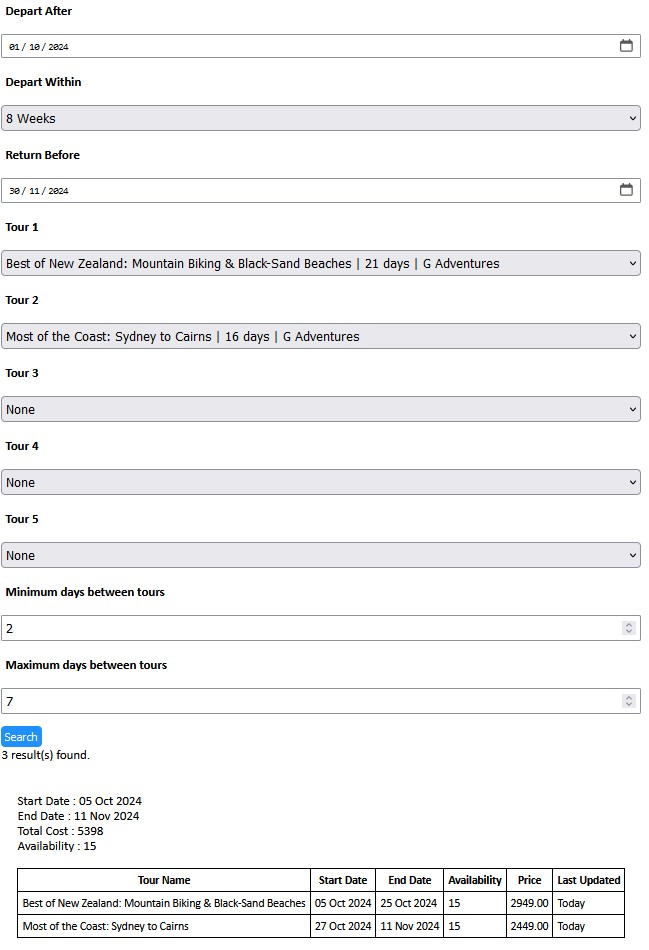

# TourTracker

## About

TourTracker is a web-based application, developed for PHP and MySQL, which aims to help users find deals on small group tours by tracking prices and availability. It also offers an Itinerary Finder, which compares start and end dates of user selected tours to help plan a longer itinerary by displaying the possibilities for combining multiple tours within a selected timeframe. 

## Present Features

The project is in ongoing development, however the current version offers proof of concept with the folllowing features implemented:

- The user can add a tour by copy and pasting the URL of any *G Adventures* or *Intrepid* tour. The name of the tour is automatically obtained from the website.

- The user can synchronise a tour: up-to-date departure, pricing and availability is automatically retrieved from the tour's website and saved within application. Support for background syncing is also available.

- A list of upcoming departures for a selected tour can be displayed showing most-recent pricing and availability information (tours with no availability are greyed out).

- A record of past prices and availability can be viewed for selected departure, providing insights into whether prices are increasing/decreasing and how quickly the tour is selling.

- The user can mark a selected departure as 'Watched', making it easier to find the departure again later by going to their 'Watchlist'.

- An 'Alerts' view also allows price and availability changes for 'Watched' departures to be quickly identified.

- Itinerary Finder: Identify whether there is potential to combine successive tours within your travel dates to create a longer itinerary.

## Screenshots

**Tours View**

**Departures View**

**View price and availability History for a selected departure.**

**Watchlist: view latest information for all watched departures.**

**Alerts**

**Itinerary Finder**

